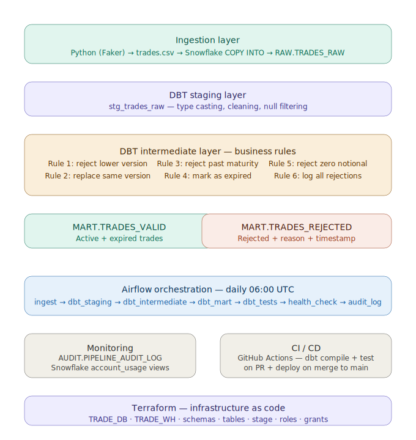
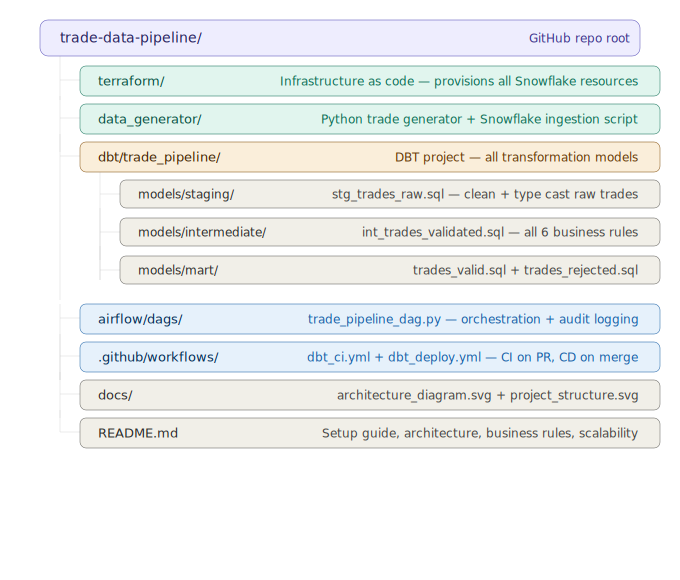

# Trade Data Pipeline — Deutsche Bank Case Study

A production-grade, end-to-end trade data pipeline built on Snowflake, DBT, Airflow, and Terraform.

## Architecture



## Tech Stack

| Component | Tool | Reason |
|-----------|------|--------|
| Infrastructure | Terraform | Reproducible, version-controlled Snowflake provisioning |
| Ingestion | Python + Snowflake COPY INTO | Native Snowflake ingestion, zero external dependencies |
| Processing | DBT Core | Industry standard transformation layer with built-in testing |
| Warehouse | Snowflake | Cloud-native, auto-scaling data warehouse |
| Orchestration | Apache Airflow 3.x | Open-source, production-grade scheduling and monitoring |
| CI/CD | GitHub Actions | Automated DBT validation and deployment on every push |

## Business Rules

| Rule | Logic | Output |
|------|-------|--------|
| 1 — Reject lower version | Incoming version < max existing version for same trade_id | REJECTED |
| 2 — Replace same version | Same trade_id + version → upsert/overwrite | ACTIVE |
| 3 — Reject past maturity | maturity_date < today (within 30 days) | REJECTED |
| 4 — Mark expired | maturity_date < today (older than 30 days) | EXPIRED |
| 5 — Reject zero notional | notional <= 0 | REJECTED |
| 6 — Log rejections | All rejected trades written with reason + timestamp | MART.TRADES_REJECTED |

## Project Structure



## Setup Guide

### Prerequisites
- Snowflake trial account
- Python 3.11
- Terraform
- DBT Core + Snowflake adapter (`pip install dbt-snowflake`)
- Apache Airflow 3.x (`pip install apache-airflow`)

### 1 — Provision Snowflake infrastructure

```bash
cd terraform
terraform init
terraform apply
```

Creates: TRADE_DB, TRADE_WH, schemas (RAW/STAGING/INTERMEDIATE/MART/AUDIT), tables, stage, roles.

### 2 — Generate and load trade data

```bash
export SNOWFLAKE_PASSWORD="your_password"
cd data_generator
python3.11 generate_trades.py
```

Generates 100 trades with deliberate edge cases (past maturity, duplicate versions, zero notional) to exercise all business rules.

### 3 — Run DBT models

```bash
cd dbt/trade_pipeline
dbt run
dbt test
```

### 4 — Start Airflow and trigger the pipeline

```bash
airflow standalone
# Visit http://localhost:8080
# Find trade_pipeline DAG and click Trigger
```

## Monitoring and Alerting

| What | How |
|------|-----|
| Every pipeline run | Logged to `AUDIT.PIPELINE_AUDIT_LOG` with counts and status |
| Failed Snowflake queries | Queried from `snowflake.account_usage.query_history` in health check task |
| Task failures | Airflow `on_failure_callback` writes FAILED record to audit table |
| Retries | 2 automatic retries with 5-minute delay on any task failure |

## Handling Potential Issues

| Issue | Strategy |
|-------|----------|
| File arrival delays | Airflow retries + configurable retry delay |
| Data quality problems | DBT tests block promotion of bad data to mart layer |
| Task failures | on_failure_callback logs to audit; Airflow retries automatically |
| Schema drift | DBT compile step in CI catches SQL errors before merge to main |
| Duplicate trades | Version-based deduplication in intermediate layer |

## Scalability — 10,000x Trade Volume

| Bottleneck | Solution |
|-----------|----------|
| Compute | Scale TRADE_WH from XS to XL — Snowflake separates storage and compute |
| Ingestion | Snowpipe handles continuous micro-batch ingestion automatically |
| Transformation | DBT is pure SQL — Snowflake handles parallelism natively |
| Orchestration | Airflow scales with CeleryExecutor or KubernetesExecutor |
| Storage | Partition TRADES_RAW by trade_date for efficient pruning |
| Monitoring | Snowflake native alerts fire on anomalies without additional tooling |
